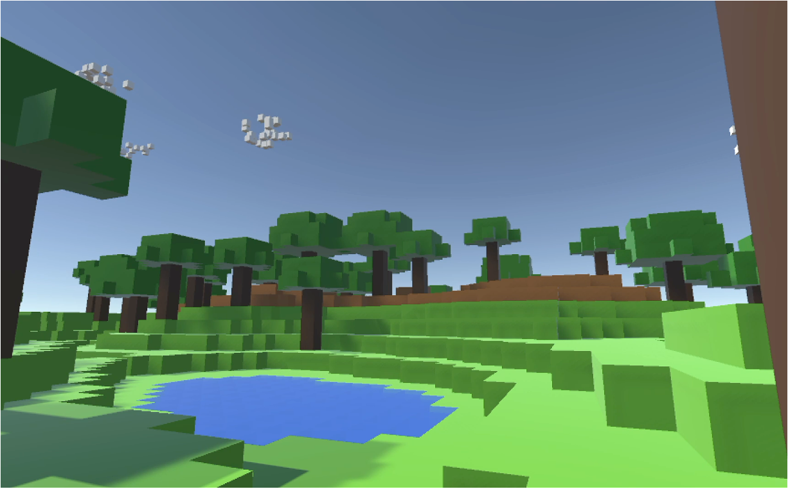

# CubeVerse - Cube World

| English | [中文](README_CN.md) |
|:---:|:---:|

## Project Overview

CubeVerse is a 3D cube world game developed using AI-assisted development tools (such as Kiro) through natural language conversations.

> **Note**: Amazon Q Developer CLI has been renamed to Kiro CLI. This project was originally developed using Amazon Q Developer CLI, and we now recommend using Kiro or Kiro CLI for continued development.

## Innovative Development Approach

Traditional game development has high technical barriers, where game producers, designers, and other non-technical team members can only describe their creative ideas through documentation without directly participating in implementation. This development model leads to slow conversion of ideas into actual features and often results in misunderstandings.

By combining **AI-assisted development tools** with **MCP (Model Context Protocol)** technology and Unity integration, we've created a new paradigm of natural language-driven game development. Developers only need to describe requirements in natural language, and AI assistants intelligently interpret instructions, automatically generate code, and directly control the game engine to implement features, achieving seamless transformation from ideas to functionality.

This project is built from scratch using Kiro and other AI development tools, including all code and engine configurations, representing a complete practice of this innovative development approach.

This solution lowers the barrier to game programming skills, enabling every team member (including non-technical personnel) to directly participate in feature development, greatly improving iteration speed and creative validation efficiency. It is particularly suitable for rapid prototyping, concept validation, and agile iteration scenarios in game studios.

## Game Showcase

*CubeVerse game screenshot - Cube-style world*

*CubeVerse gameplay demonstration - Explore the cube world with dynamic weather and interactive elements*

📹 [Download Full Video (MP4)](Assets/Resources/showcase.mp4) - High quality gameplay video

## Game Features

### 🎮 Core Gameplay
- **First-Person Perspective Control**: Smooth player movement and camera control
- **Cube World Generation**: Procedurally generated cube terrain
- **Physics Interaction**: Realistic physics collision and gravity system
- **Interactive Animals**: Cute animals roaming the world, including rabbits, sheep, and chickens with natural behaviors
- **Ferris Wheel**: A rotating Ferris wheel landmark that adds life to the cube world

### 🌦️ Weather System
- **Rain System**: Realistic rainfall effects with rain particle effects
- **Snow System**: Beautiful snowfall effects creating winter atmosphere
- **Lightning System**: Dynamic lightning effects enhancing storm experience
- **Rainbow System**: Post-rain rainbows adding visual beauty
- **Cloud System**: Dynamic cloud generation and movement

### 🌅 Day-Night Cycle
- **Day-Night Transition**: Smooth day-night transition effects
- **Dynamic Lighting**: Environmental lighting that changes with time
- **Star System**: Starry sky effects during nighttime

### ⚡ Performance Optimization
- **Object Pool Management**: Efficient object reuse mechanism
- **Quality Settings**: Adjustable graphics quality options
- **LOD System**: Distance-based level of detail

## Development Tools

### AI-Assisted Development + MCP Unity
This project is developed using **Kiro** and other AI development tools combined with **MCP Unity** through natural language conversations:

#### MCP Unity Integration
- **Project Repository**: [https://github.com/CoderGamester/mcp-unity](https://github.com/CoderGamester/mcp-unity)
- **MCP Protocol**: Model Context Protocol, enabling direct AI interaction with Unity
- **Seamless Integration**: AI assistants directly operate Unity Editor through MCP
- **Real-time Operations**: AI can directly create and modify game objects and components without manual intervention

#### Kiro Collaborative Development Features
- **Natural Language Programming**: Generate code through conversations with Kiro, lowering programming barriers
- **Intelligent Code Generation**: Complex weather systems and physics interactions generated by AI understanding requirements
- **Real-time Problem Solving**: Technical issues during development resolved through natural language descriptions
- **Code Optimization Suggestions**: AI proactively provides performance optimization and code improvement suggestions
- **Automatic Documentation Generation**: Project documentation and code comments assisted by AI
- **Direct Engine Operations**: Through MCP protocol, AI can directly create scenes, add components, and set parameters in Unity

### Development Environment
- **Game Engine**: Unity 2022.3 LTS
- **Programming Language**: C#
- **AI Tools**: Kiro or Kiro CLI (formerly Amazon Q Developer CLI)

## Installation and Setup

### Requirements
- Unity 2022.3 LTS or higher
- Kiro or Kiro CLI (formerly Amazon Q Developer CLI)
- Node.js 18+ (for running MCP Unity server)

### MCP Installation Steps
Refer to https://github.com/CoderGamester/mcp-unity/blob/main/README.md for MCP configuration

### Project Setup Steps
1. Open the project using Unity Hub
2. Wait for Unity to import all assets
3. In the Project window, navigate to the `Assets/Scenes` folder
4. Double-click to open the `SampleScene.scene` file
5. Click the play button at the top of the editor to start the game

### Controls
- **WASD** - Movement
- **Mouse** - Camera control
- **Space** - Jump

---

**Use AI-assisted development tools to make game development more efficient!** 🚀
